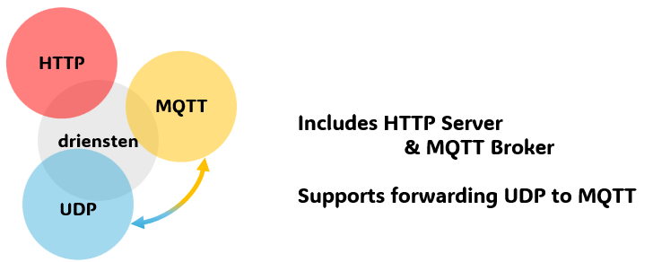

# driensten

 

driensten provides three services: an HTTP server, an MQTT broker, and a UDP-MQTT bridge.

[日本語版 README はこちら](README.ja.md)

# Features
1. **HTTP Server**  
   Hosts static HTML files.

2. **MQTT Broker**  
   Operates as an MQTT broker and provides MQTT communication.

3. **UDP–MQTT Bridge**  
   1. Publishes messages received over UDP to MQTT.  
   2. Sends messages subscribed via MQTT out over UDP.

# Configuration
All settings are defined in `driensten.yaml` placed alongside the executable.

```yaml
HTTP:
    listen: 127.0.0.1:8080
    root: dist
    tls:
        enable: false
        cert: server.crt
        key: server.key
MQTT:
  tcp: 127.0.0.1:1883
  websocket: 127.0.0.1:9090
  auth:
    mode: none  # none | password | cert
  tls:
    enable: false
    cert: server.crt
    key: server.key
UDP:
  listen: 127.0.0.1:6565
  allow_unauthenticated_forwards: false
  forwards:
    127.0.0.1:6566:
      - topicA
      - topicB
    127.0.0.1:6567:
      - topicC
      - topicD
```

## HTTP Server Settings

1. Listen address
    Specify the host and port for the HTTP server in the config.

    - Example: Serve on port 8080
        ```yaml
        HTTP:
            listen: :8080
        ```
    - Example: Serve only on localhost
        ```yaml
        HTTP:
            listen: 127.0.0.1:8080
        ```
2. Document root
    Set the directory to be served. You may use an absolute path, or a path relative to the executable.
    ```yaml
    HTTP:
        root: dist
    ```

## MQTT Broker Settings
Define the TCP and WebSocket listen addresses:
```yaml
MQTT:
  tcp: 127.0.0.1:1883
  websocket: 127.0.0.1:9090
```

### Authentication

Authentication mode is controlled by `MQTT.auth.mode`. Three modes are available:

| Mode | Description |
|------|-------------|
| `none` | No authentication required. A warning is logged at startup. Use only for development or PoC. |
| `password` | Username and password authentication. Define users under `MQTT.auth.users`. |
| `cert` | TLS client certificate authentication. Requires `MQTT.tls.enable: true`. |

**`none` mode (development / PoC):**
```yaml
MQTT:
  auth:
    mode: none
```

**`password` mode:**
```yaml
MQTT:
  auth:
    mode: password
    users:
      - username: alice
        password: secret
      - username: bob
        password: pass123
```

**`cert` mode:**
```yaml
MQTT:
  auth:
    mode: cert
  tls:
    enable: true
    cert: server.crt
    key: server.key
```
In `cert` mode, clients must present a valid TLS client certificate during the handshake. Server-side TLS must be enabled and the server must be configured to request client certificates.

## UDP Bridge Settings

The UDP bridge supports two functions:

1. UDP → MQTT
    Receives UDP packets on the configured port and publishes them to MQTT.
    ```yaml
    UDP:
        listen: 127.0.0.1:6565
    ```
    
    To specify the target topic, include the topic name followed by a newline at the start of the UDP payload:
    ```
    <topic-name>\n<payload>
    ```

    > **Note:** Only topics that match a filter defined in `UDP.forwards` are accepted. Packets with an unrecognized or empty topic are silently discarded. Topic filters support MQTT wildcards (`+` for a single level, `#` for all remaining levels).
2. MQTT → UDP
    Forwards MQTT messages on configured topics out over UDP to their associated addresses:
    ```yaml
    UDP:
      forwards:
        127.0.0.1:5653:
          - topicA
          - topicB
        127.0.0.1:5656:
          - topicC
          - topicD
    ```

### MQTT → UDP Forwarding and Authentication

MQTT → UDP forwarding is only active when the MQTT broker has authentication enabled (`MQTT.auth.mode: password` or `cert`). This prevents unauthenticated clients from injecting arbitrary data into backend UDP services.

| `MQTT.auth.mode` | `UDP.allow_unauthenticated_forwards` | MQTT → UDP forwarding |
|---|---|---|
| `password` or `cert` | any | **Enabled** (authenticated clients only) |
| `none` | `false` (default) | **Disabled** — safe default for auth-less setups |
| `none` | `true` | **Enabled** — unauthenticated clients can inject data |

**Development / PoC** — to use MQTT → UDP forwarding without authentication, explicitly opt in:
```yaml
MQTT:
  auth:
    mode: none
UDP:
  allow_unauthenticated_forwards: true  # anyone can inject data into UDP streams
```

> **Warning:** Setting `allow_unauthenticated_forwards: true` while `auth.mode: none` means any process that can reach the MQTT port can send arbitrary data to the configured UDP destinations. Use only in isolated development environments.


