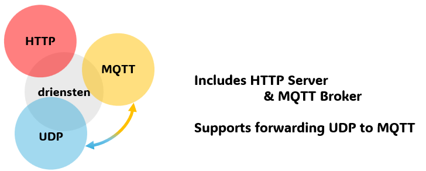

# driensten

 

driensten provides three services: an HTTP server, an MQTT broker, and a UDP-MQTT bridge.

# Features
1. **HTTP Server**  
   Hosts static HTML files.

2. **MQTT Broker**  
   Operates as an MQTT broker and provides MQTT communication.

3. **UDP–MQTT Bridge**  
   1. Publishes messages received over UDP to MQTT.  
   2. Sends messages subscribed via MQTT out over UDP.

# Configuration
All settings are defined in `driensten.yaml` placed alongside the executable.

```yaml
HTTP:
    listen: 127.0.0.1:8080
    root: dist
    tls:
        enable: false
        cert: server.crt
        key: server.key
MQTT:
  tcp: 127.0.0.1:1883
  websocket: 127.0.0.1:9090
  tls:
    enable: false
    cert: server.crt
    key: server.key
UDP:
  listen: 127.0.0.1:6565
  forwards:
    127.0.0.1:6566:
      - topicA
      - topicB
    127.0.0.1:6567:
      - topicC
      - topicD
```

## HTTP Server Settings

1. Listen address
    Specify the host and port for the HTTP server in the config.

    - Example: Serve on port 8080
        ```yaml
        HTTP:
            listen: :8080
        ```
    - Example: Serve only on localhost
        ```yaml
        HTTP:
            listen: 127.0.0.1:8080
        ```
2. Document root
    Set the directory to be served. You may use an absolute path, or a path relative to the executable.
    ```yaml
    HTTP:
        root: dist
    ```

## MQTT Broker Settings
Define the TCP and WebSocket listen addresses:
```yaml
MQTT:
  tcp: 127.0.0.1:1883
  websocket: 127.0.0.1:9090
```

## UDP Bridge Settings

The UDP bridge supports two functions:

1. UDP → MQTT
    Receives UDP packets on the configured port and publishes them to MQTT.
    ```yaml
    UDP:
        listen: 127.0.0.1:6565
    ```
    
    To specify the target topic, include the topic name followed by a newline at the start of the UDP payload:
    ```php
    <topic-name>\n<payload>
    ```
2. MQTT → UDP
    Forwards MQTT messages on configured topics out over UDP to their associated addresses:
    ```yaml
    UDP:
      forwards:
        127.0.0.1:5653:
          - topicA
          - topicB
        127.0.0.1:5656:
          - topicC
          - topicD
    ```


