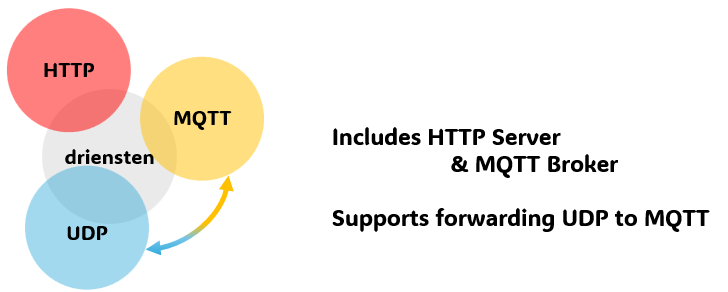

 

driensten は、HTTPサーバとMQTTブローカとUDP-MQTTブリッジの３つ(drie)のサービス(diensten)を提供します。

# 機能
1. HTTPサーバ
  静的 HTML ファイルをホストできます。

2. MQTTブローカー
  MQTTブローカとして動作し、MQTT通信を提供します。

3. UDP-MQTTブリッジ
    1. UDP通信で受信したメッセージをMQTTへPublishします。
    2. MQTT通信でsubscribeしたメッセージをUDPへ送信します。

# 設定方法
実行ファイル直下の ```driensten.yaml```で設定をします。

```yaml
HTTP:
    listen: 127.0.0.1:8080
    root: dist
    tls:
      enable: false
      cert: server.crt
      key: server.key
MQTT:
  tcp: 127.0.0.1:1883
  websocket: 127.0.0.1:9090
  tls:
    enable: false
    cert: server.crt
    key: server.key
UDP:
  listen: 127.0.0.1:6565
  forwards:
    127.0.0.1:6566:
      - topicA
      - topicB
    127.0.0.1:6567:
      - topicC
      - topicD
```

## HTTPサーバ設定

1. listen ポートの設定
  設定ファイル中で HTTP サーバーのポート番号を指定できます。
    - 例: ポート 8080 で HTTP サービスを提供
        ```yaml
        HTTP: 
            listen: :8080
        ```
    - 例: localhost のみに HTTP サービスを提供
        ```yaml
        HTTP: 
            listen: 127.0.0.1:8080
        ```
2. ドキュメントルート (root) の設定
  設定ファイル中でホストするディレクトリを指定できます。
  絶対パスで指定することも可能です。相対パス指定の場合は、実行ファイルからの相対パスになります。
    ```yaml
    HTTP:
      root: dist
    ```

## MQTTブローカー設定
TCP および WebSocket の```listen```先をそれぞれ指定できます。
```yaml
MQTT:
  tcp: 127.0.0.1:1883
  websocket: 127.0.0.1:9090
```

## UDPブリッジ設定
UDPブリッジ機能は、２つの機能を持っています.

1. UDP→MQTT
  指定ポートで受信した UDP データを MQTT に Publish します。

    ```yaml
    UDP:
      listen: 127.0.0.1:6565
    ```

    送信先トピック名の指定には、  UDPのペイロードに、MQTTのトピック名を含めます。

      ```トピック名```\n```ペイロード```
    
    のように、ペイロードの先頭にトピック名＋\n（改行コード）を含めてください。

2. MQTT→UDP
    指定されたUDPポートに関連付けされたMQTTトピックのメッセージを、UDPに送信します。

      ```yaml
      UDP:
        forwards:
          127.0.0.1:5653:
            - topicA
            - topicB
          127.0.0.1:5656:
            - topicC
            - topicD
      ```

